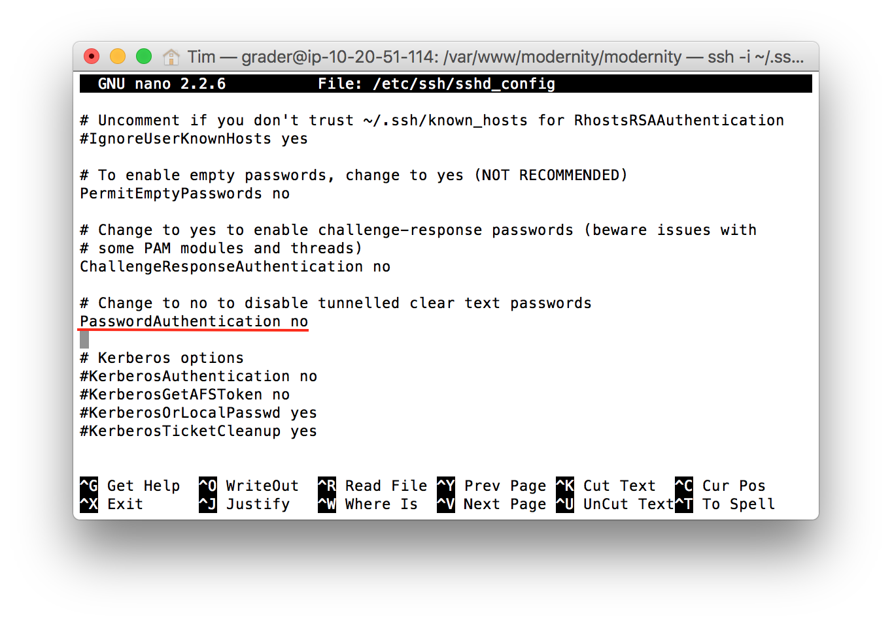

# Udacity-Server-Configuration
You will take a baseline installation of a Linux distribution on a virtual machine and prepare it to host your web applications, to include installing updates, securing it from a number of attack vectors and installing/configuring web and database servers.

## Connection Parameters

IP Address: 35.166.35.139

SSH Port: 2200

Application URL: [http://ec2-35-166-35-139.us-west-2.compute.amazonaws.com](http://ec2-35-166-35-139.us-west-2.compute.amazonaws.com/)

`grader` Linux user password: 8b7df143d91c716ecfa5fc1730022f6b421b05cedee8fd52b1fc65a96030ad52

`catalogue` Postgres user password: 3645c735a4cc5787fb6f377751350acf

## Summary

#### Configuration

1. Created `grader` [account](#add-user) with `sudo` permission
2. Updated existing [packages](#update-packages)
3. Changed [timezone](#change-timezone) to Pacific/Auckland
4. Changed [SSH port](#change-ssh) to 2200
5. Disabled [login as `root`](#disable-root)
6. Enforced [key-based authentication](#create-key)
7. [Blocked access](#firewall) to all TCP ports other than 80, 2200, and 123
8. [Installed](#install-packages) packages, dependencies, and Python libraries (those installed in the virtual environment are marked with an asterisk):
 - Apache
 - mod_wsgi
 - pip
 - python-dev
 - virtualenv
 - Flask*
 - httplib2*
 - sqlalchemy*
 - oauth2client*
 - requests*
 - PostgreSQL
9. Created a [PostgreSQL user](#postgres) `catalogue`, with permission to access the `catalogue` database locally with password authentication
10. Migrated [application data](#app) and updated relevant parameters (e.g. database URI, Google JavaScript domain, filepaths, and upload directory permissions)

#### Resources

- [How To Deploy a Flask Application on an Ubuntu VPS](https://www.digitalocean.com/community/tutorials/how-to-deploy-a-flask-application-on-an-ubuntu-vps)
- [FSND-P5_Linux-Server-Configuration](https://github.com/stueken/FSND-P5_Linux-Server-Configuration)

## Method

#### Basic Configuration

<a name="add-user"></a> 
###### Adding a User
A user named `grader` has been created and granted `sudo` permissions:

```
root@ip-10-20-51-114:~# sudo adduser grader
...
root@ip-10-20-51-114:~# sudo adduser grader sudo
```

<a name="update-packages"></a> 
###### Updating Existing Packages
Packages were updated:

```
root@ip-10-20-51-114:~# sudo apt-get update && sudo apt-get upgrade
```

<a name="change-timezone"></a> 
###### Change Timezone
The server timezone has been changed to Pacific/Auckand:

```
root@ip-10-20-51-114:~# dpkg-reconfigure tzdata

Current default time zone: 'Pacific/Auckland'
Local time is now:      Wed Dec 14 11:49:01 NZDT 2016.
Universal Time is now:  Tue Dec 13 22:49:01 UTC 2016.
```

#### SSH Configuration

<a name="change-ssh"></a>
###### Change SSH Port

The SSH port has been changed from 22 to 2200 by altering line 5 of `/etc/ssh/sshd_config`:


<a name="disable-root"></a>
###### Disable Root Login

Line 28 was changed from `PermitRootLogin without-password` to `PermitRootLogin no` to disable root user login:


<a name="create-key"></a>
###### Create SSH Key

A public-private key pair was generated on a local machine using `ssh-keygen`, and that file was uploaded to the server:

```$ ssh-copy-id grader.pub grader@35.166.35.139 -p2200```

After verifying that the public key had been uploaded, `sshd_config` was altered to disable password authentication (`PasswordAuthentication no`).



As desired, it is no longer possible to login as the root user with the key issued during the creation of the EC2 instance:

```
~ $ ssh -i ~/.ssh/udacity_key.rsa root@35.166.35.139 -p2200
Permission denied (publickey).
```

<a name="firewall"></a>
#### Firewall Configuration

The firewall was configured using `ufw`, enabling only incoming SSH, HTTP, and NTP traffic:

```
grader@ip-10-20-51-114:~$ sudo ufw allow 2200/tcp # SSH
grader@ip-10-20-51-114:~$ sudo ufw allow 80/tcp # HTTP
grader@ip-10-20-51-114:~$ sudo ufw allow 123/tcp #NTP
grader@ip-10-20-51-114:~$ sudo ufw enable
```

Checking the firewall status (via `sudo ufw status`) confirms that these ports are available. Given that the `DEFAULT_INPUT_POLICY` is DROP (c.f. `etc/default/ufw`), these will be the only open incoming ports:

```
To                         Action      From
--                         ------      ----
2200/tcp                   ALLOW IN    Anywhere
80/tcp                     ALLOW IN    Anywhere
123/tcp                    ALLOW IN    Anywhere
2200/tcp (v6)              ALLOW IN    Anywhere (v6)
80/tcp (v6)                ALLOW IN    Anywhere (v6)
123/tcp (v6)               ALLOW IN    Anywhere (v6)
```

<a name="install-packages"></a>
### Setting Up Flask on Apache

The Apache webserver was installed to serve a Flask WSGI application.

First, the Apache package and its dependencies was installed:

```grader@ip-10-20-51-114:~$ sudo apt-get install apache2```

This made it possible to access the Apache default page at [35.166.35.139](http://35.166.35.139)


<a name="flask-app"></a>
Following the instructions [here](https://www.digitalocean.com/community/tutorials/how-to-deploy-a-flask-application-on-an-ubuntu-vps), dependencies were installed and a virtual host configured to serve a rudimentary Flask app:


<a name="postgres"></a>
### PostgreSQL

Before migrating the catalogue application to EC2, it was necessary to establish a PostgreSQL database to provide data for the application.

First, PostgreSQL was installed:

```grader@ip-10-20-51-114:~$ sudo apt-get install postgresql postgresql-contrib```

Checking `/etc/postgresql/9.3/main/pg_hba.conf` confirmed that only local connections (conversely, no remote connections) to the database were allowed.

A database user `catalogue`, with permission to create tables, was created:

```createuser -dRS catalogue -W```

At the password prompt, the new user was given a password.

An entry was added to `/etc/postgresql/9.3/main/pg_hba.conf` for the user `catalogue`, requiring md5 authentication, and only allowing local connections.


Using `psql`, a database named `catalogue` was created and populated from a data dump generated by `pg_dump`.

<a name="app"></a>
### Migrating The App

Lastly, the application's code was migrated to the EC2 instance. The simplest way to do this was via SCP, replacing the contents of the ["Hello, World" app](#flask-app) with my application code; the application code is served from `/var/www/modernity/modernity`.

Naturally, the database URI and other credentials needed to be altered to support the new host. Following these modifications, the [application](http://ec2-35-166-35-139.us-west-2.compute.amazonaws.com) began to work as expected.

More details on the functionality of the application are available [here](http://github.com/MisterTJB/Udacity-Catalogue)